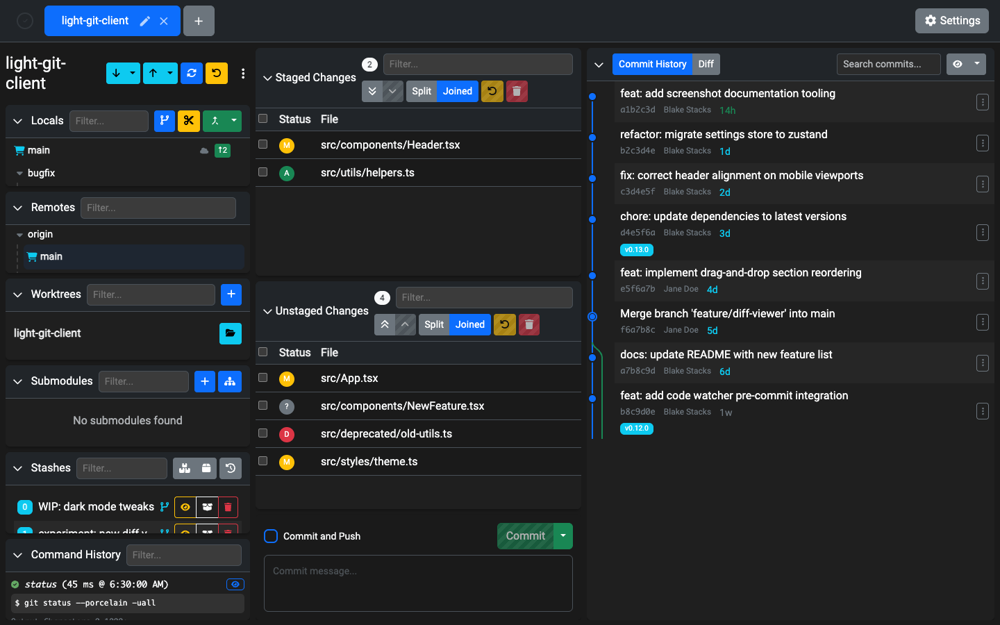
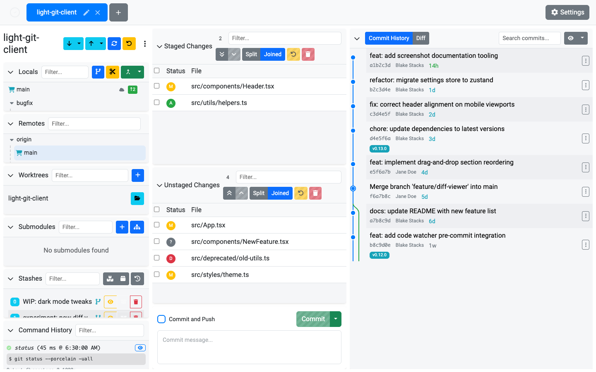
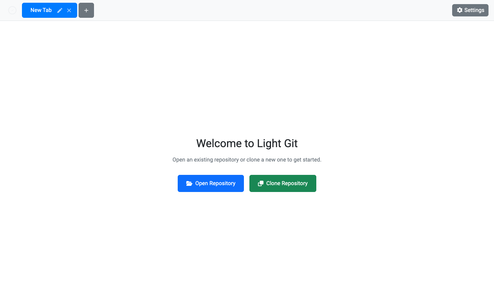
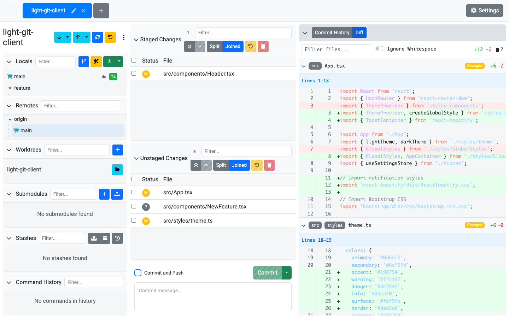
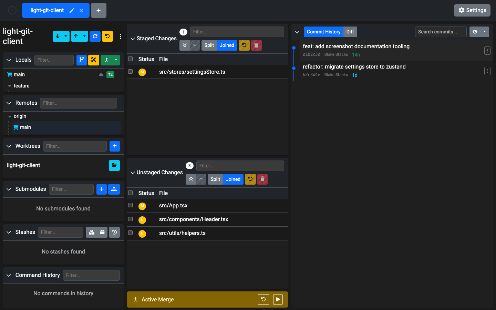
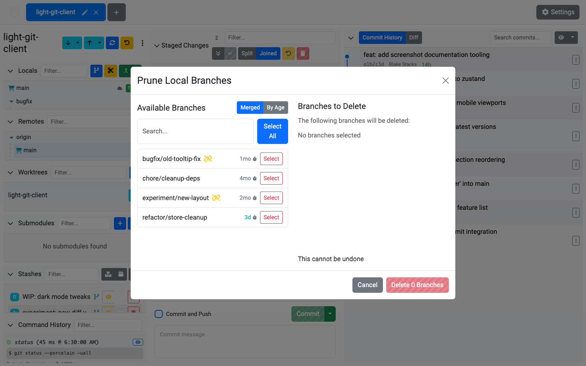
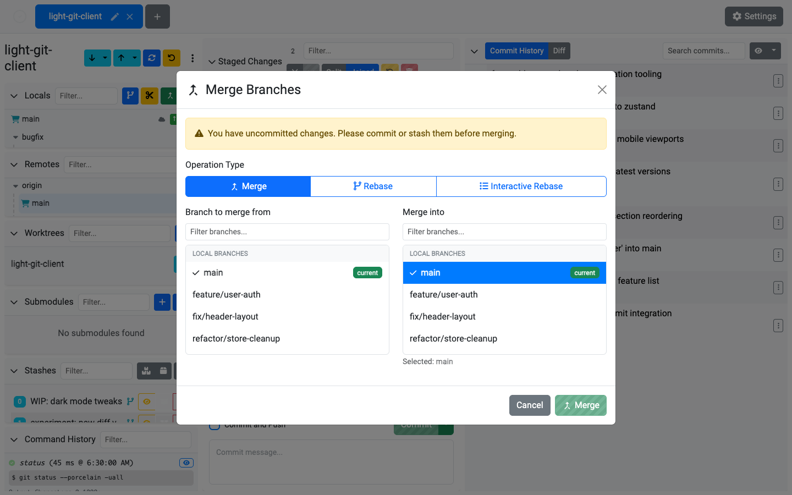

# Light Git Client
A light, elegant git client

## Installation
[Download](https://blake.industries/p/light-git-client)

Options:
* Portable
  * No install necessary, no auto-update (except Linux)
  * Mac (.dmg), Windows, Linux
* Installer
  * Installs app, with auto-update
  * Windows

## Background
This is a WIP project to address the following failings of other git clients:
* Aesthetic appeal
* Non-blocking actions
* Additional features
* Reliability

## Key New Features
* Relaxed Material Design
   * Material design, but focused on shape, depth, and separation
   * Reduced use of lines & background-less buttons
   * Thicker lines where possible
* Worktree Support (multiple tabs or within a single tab)
* Submodule Support (add, update)
* Code Watchers - Customizable regex watchers that run before you commit
   * Can be used to prevent:
     * Duplicate lines
     * Poor lambda variable names (` x,y,z => `, What does it mean, Grommit?)
     * Leftover `console.log` lines
     * Gotchas, stupid mistakes, and more!
* Built-in git config editor
* Diff hunks editable, selectable in viewer
   * Why leave the app when you don't have to?
* Git command history
   * Want to learn more console commands?
   * Or just want to see what the application is actually doing?
* Autocomplete on changed filenames & path in commit messages

### TODO:
* Clone &check; (10/1/18)
* Branching visualization &check; (12/19/18)
* Tag editor (tags currently visible in commit history)
* Ability to move tabs &check; (4/10/19)
* More force- options &check; (Nov 2018)

## Screenshots

