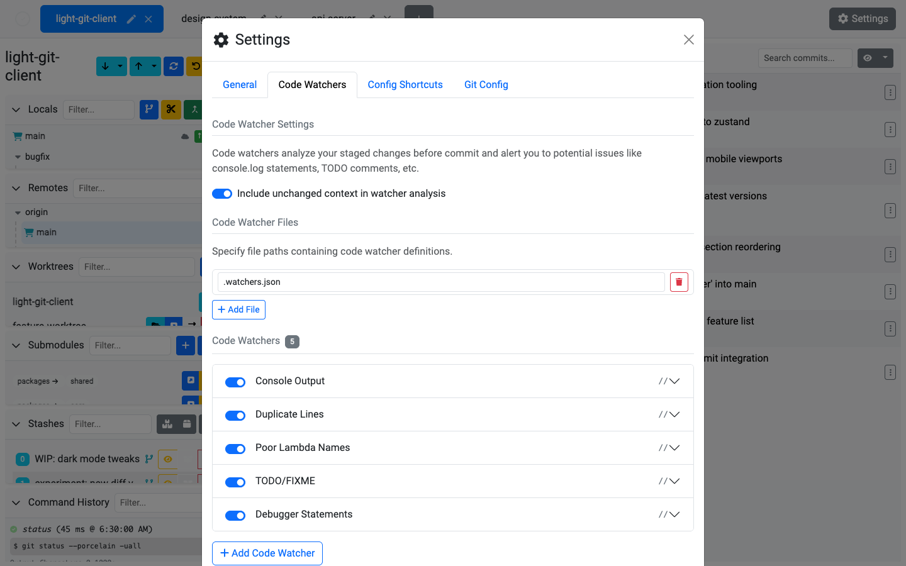

# Code Watchers

Code Watchers are customizable regex rules that automatically scan your staged changes before every commit. They help catch common mistakes, enforce coding standards, and prevent accidental commits of debug code.

## How It Works

1. Define one or more regex patterns as watcher rules
2. Before each commit, the app runs all enabled watchers against your staged diffs
3. If any rules match, an **alerts modal** appears showing every match
4. You can review the matches and choose to **Commit Anyway** or go back and fix them

## Configuring Watchers

Watchers are managed in **Settings > Code Watchers**.

### Watcher Properties

| Property | Description |
| -------- | ----------- |
| **Pattern** | A regular expression to match against diff content. |
| **Flags** | Regex flags (e.g. `g`, `i`, `m`). |
| **File Pattern** | An optional glob or regex to limit the watcher to specific file paths. |
| **Message** | A custom message to display when the watcher matches. |
| **Enabled** | Toggle the watcher on or off without deleting it. |

### Watcher Sources

- **User watchers** — Defined directly in the app's settings, personal to you
- **File watchers** — Loaded from external config files (configurable paths), allowing team-wide rules to be shared via version control

### Managing Watchers

- **Add** new watchers with the add button
- **Copy** an existing watcher to create a variation
- **Remove** watchers you no longer need
- **Enable/disable** individual watchers without removing them
- **Include unchanged context** — Optionally include surrounding context lines in the analysis for more accurate matching

## The Alerts Modal

When watchers match, the alerts modal shows:

- Matches grouped by file in an accordion layout
- Each match shows the watcher name, matching line, and the relevant hunk
- Filter by file or watcher name to focus on specific issues
- Severity levels: **error**, **warning**, **info**

## Example Use Cases

| Pattern | Purpose |
| ------- | ------- |
| `console\.log` | Catch leftover debug logging |
| `TODO\|FIXME\|HACK` | Flag known technical debt |
| `\b(x\|y\|z)\s*=>` | Enforce meaningful lambda parameter names |
| `debugger` | Prevent JavaScript debugger statements |
| `<<<<<<\|>>>>>>\|======` | Catch unresolved merge conflict markers |

## Tips

- Share watcher configs with your team by storing watcher files in the repository and adding the path in settings
- Use file patterns to scope watchers — no need to check CSS files for `console.log`
- Watchers run only on the diff, not the entire file, so they're fast even in large codebases
- The alerts modal lets you commit anyway if the matches are intentional — it's a guardrail, not a blocker
