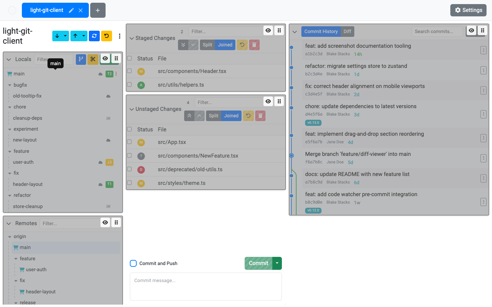

# Customizing Layout

Light Git Client's interface is built from draggable, hideable cards that you can arrange to match your workflow.

## Edit Sections Mode

To start customizing your layout:

1. Click the **Edit Sections** button in the title bar
2. The interface enters edit mode with visual overlays on each card
3. Rearrange, show, or hide cards
4. Click **Edit Sections** again to exit edit mode and save your layout

## Drag and Drop

In edit mode, each visible card shows a **drag handle**. Click and hold the handle to drag the card to a new position within its column.

The main view is divided into **three columns**:

- **Left column** — Typically branches, worktrees, submodules, stashes, command history
- **Middle column** — Typically staged and unstaged changes
- **Right column** — Typically commit history and diff viewer

Drag cards within a column to reorder them.

## Show and Hide Cards

- **Hide a card** — In edit mode, click the **Hide** button on any visible card's overlay
- **Show a hidden card** — Hidden cards appear as collapsed placeholders with a **Show Section** button. Click it to restore the card.

## Available Cards

The following cards can be arranged and toggled:

- Local Branches
- Remote Branches
- Worktrees
- Submodules
- Stashes
- Command History
- Staged Changes
- Unstaged Changes
- Commit History

## Per-Repository Layout

Your layout preferences are saved **per repository** in the app's settings. This means different repositories can have different layouts — useful if you work with repos of varying complexity.

## Tips

- Hide cards you rarely use (like Submodules or Worktrees) to give more space to the cards you use most
- If you work primarily with branches and commit history, move those cards to the top for quick access
- The layout persists across sessions — set it up once and forget about it
