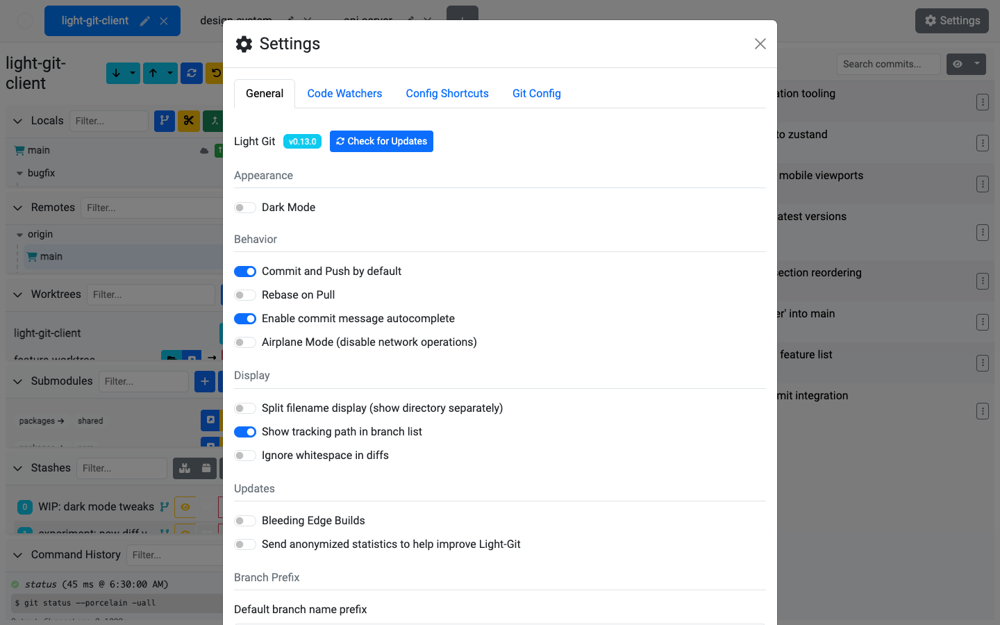

# Settings

The Settings panel lets you configure Light Git Client's behavior, appearance, and Git integration. It's organized into four tabs.

## General Settings

| Setting | Description |
| ------- | ----------- |
| **Version Info** | View the current version, check for updates, and install available updates. |
| **Dark Mode** | Toggle between light and dark themes. |
| **Commit and Push** | Enable by default to automatically push after every commit. |
| **Rebase on Pull** | Use `git pull --rebase` instead of merge when pulling. |
| **Commit Message Autocomplete** | Enable filename and branch name suggestions in the commit message editor. |
| **Airplane Mode** | Disable all network operations (fetch, push, pull) for offline work. |
| **Split Filename Display** | Show file paths split into directory and filename columns. |
| **Show Tracking Path** | Display the remote tracking branch path next to local branches. |
| **Ignore Whitespace** | Ignore whitespace differences in the diff viewer by default. |
| **Bleeding Edge Builds** | Opt in to pre-release builds for the latest features. |
| **Anonymized Stats** | Toggle anonymized usage statistics. |
| **Branch Name Prefix** | Automatically prepend a prefix when creating new branches (e.g. `feature/`, `fix/`). |

## Code Watchers

Configure regex-based code watchers that scan your changes before each commit. See [Code Watchers](/features/code-watchers) for full details.

## Config Shortcuts

Quick access to common Git configuration values:

| Setting | Description |
| ------- | ----------- |
| **User Name** | Your `user.name` in Git config. |
| **User Email** | Your `user.email` in Git config. |
| **Mergetool Name** | The name of your configured merge tool. |
| **Mergetool Command** | The command to launch the merge tool. |
| **Credential Helper** | Choose from `cache`, `store`, `osxkeychain`, or `wincred`. |
| **Cache Timeout** | How long cached credentials are kept (when using `cache` helper). |

Each shortcut can be set at the **local** (per-repository) or **global** scope.

## Git Config

The full Git configuration editor:

| Feature | Description |
| ------- | ----------- |
| **Git Path** | Set the path to the Git executable if it's not on your system PATH. |
| **Bash Path** | Set the path to Bash (used for some Git operations). |
| **Mergetool** | Configure the merge tool command. |
| **Command Timeout** | Set the maximum time (in seconds) to wait for a Git command before timing out. |
| **Config Table** | View, edit, add, and delete arbitrary Git config key/value pairs. |
| **Filter & Sort** | Filter and sort the config table to find specific settings. |

## Tips

- Use **Airplane Mode** when working on a plane or in an environment without network access — it prevents accidental fetch/push failures from slowing you down
- The **Branch Name Prefix** setting is great for teams with naming conventions (e.g. `feature/`, `bugfix/`, `hotfix/`)
- If Git commands are timing out, increase the **Command Timeout** in the Git Config tab
- The full config editor gives you the same power as `git config --list` and `git config --edit`, but with a visual interface
