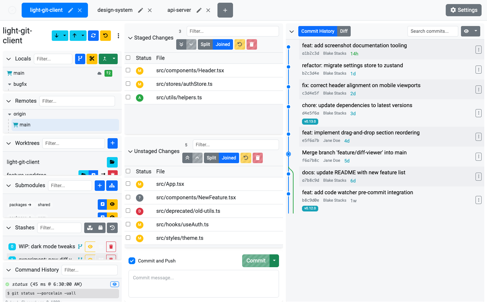

# Tabs

Light Git Client supports multiple tabs, letting you work with several repositories (or worktrees) simultaneously without opening separate windows.

## Tab Management

| Action | Description |
| ------ | ----------- |
| **Add Tab** | Click the **+** button in the tab bar to open a new, empty tab. |
| **Close Tab** | Close a tab when you're done with it. |
| **Rename Tab** | Click the edit icon on a tab to give it a custom name. |
| **Reorder Tabs** | Drag and drop tabs to rearrange them in the tab bar. |

## Tab Behavior

- Each tab maintains its own repository path and state
- The active tab is visually highlighted
- Switching tabs instantly loads the corresponding repository's branches, changes, and history
- Tabs remember their state — switching away and back preserves your scroll position, selections, and open diffs

## Drag and Drop

Tabs support full drag-and-drop reordering. Click and hold a tab, then drag it to a new position in the tab bar. This uses the same smooth drag-and-drop system used throughout the app.

## Use Cases

- Keep your main project in one tab while reviewing a PR in another
- Open different worktrees of the same repository in separate tabs
- Open submodules in dedicated tabs for focused work

## Tips

- Rename tabs to keep track of what each one is for, especially when working with multiple worktrees of the same repo
- Opening a [worktree](/features/worktrees) or [submodule](/features/submodules) in a new tab automatically creates a named tab
